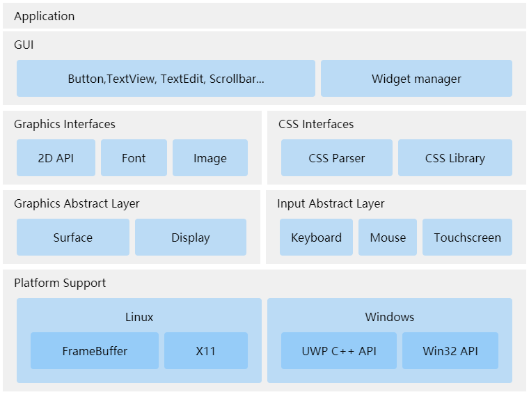

# 架构

[软件架构](https://zh.wikipedia.org/wiki/%E8%BD%AF%E4%BB%B6%E6%9E%B6%E6%9E%84)是有关软件整体结构与组件的抽象描述，用于指导大型软件系统各个方面的设计，它包括了软件组件、组件之间的关系，组件特性以及组件间关系的特性。

如上图所示，从底至上，LCUI 由如下几大模块组成：

* **平台支持（Platform Support）：**将来自不同操作系统的接口进行抽象，为 LCUI 上层提供统一的驱动接口。
* **图形抽象层（ Graphics Abstraction Layer）：**基于平台支持模块提供的图形驱动，将各个操作系统中的窗口操作接口抽象成表面（Surface）和显示（Display）两类接口，表面模块负责将组件映射到与之绑定的窗口，而显示模块则用于向上层应用程序提供屏幕相关信息和表面渲染模式切换功能。
* **输入抽象层（ Input Abstraction Layer）：**和图形抽象层类似，输入抽象层将 LCUI 涉及的所有输入设备，如键盘（keyboard）、鼠标（mouse）、触摸屏（touch screen）等抽象了出来，为上层提供一致的接口。
* **图形接口（Graphics Interfaces）：**该模块基于图形抽象层为上层应用程序提供图形相关的接口，如绘制边框、阴影、输出文本、填充矩形等等。
* **CSS 接口（CSS Interfaces）：**该模块包含 CSS 解析器和 CSS 数据库，用于控制组件的样式。
* **图形用户界面（GUI）：**该模块为上层应用程序提供了组件的操作接口和一些基础组件，并负责维护组件树、事件处理、样式计算和渲染。

