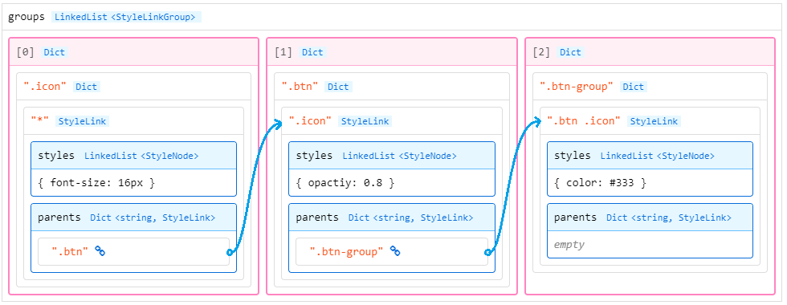

# CSS 数据库

### 简单的例子

以下示例简单的展示了如何存储和查询 CSS 样式：

```c
#include <LCUI.h>
#include <LCUI/gui/css_library.h>

void PutStyleSheet(void)
{
    LCUI_Color black = RGB(0, 0, 0);
    LCUI_Selector selector = Selector(".toolbar .button");
    LCUI_StyleSheet stylesheet = StyleSheet();

    SetStyle(stylesheet, key_color, black, color);
    LCUI_PutStyleSheet(selector, stylesheet, NULL);
    StyleSheet_Delete(stylesheet);
    Selector_Delete(selector);
}

void GetStyleSheet(void)
{
    LCUI_Selector selector = Selector(".button");
    LCUI_StyleSheet stylesheet = StyleSheet();
    LCUI_GetStyleSheet(selector, stylesheet);
    LCUI_PrintStyleSheet(stylesheet);
    StyleSheet_Delete(stylesheet);
    Selector_Delete(selector);
}

int main(void)
{
    LCUI_InitCSSLibrary();
    PutStyleSheet();
    GetStyleSheet();
    LCUI_FreeCSSLibrary();
    return 0;
}
```

从这个示例中我们可以了解到：

* 在使用 CSS 数据库前，需要调用 `LCUI_InitCSSLibrary()` 初始化 CSS 数据库。
* 选择器是存储和查询 CSS 样式的依据，CSS 数据库引擎会根据它来选择合适的存储位置。
* 我们手动创建的选择器和样式表在使用完后都需要手动销毁。
* `LCUI_PrintStyleSheet()` 函数用于以 `key: value` 的格式打印样式表中的内容。
* 在使用完 CSS 数据库后，需要调用 `LCUI_FreeCSSLibrary()` 释放 CSS 数据库占用的资源。

### 术语约定

* 选择器（Selector）是一个定义了 CSS 样式作用对象的查找规则的字符串。
* 选择器结点（SelectorNode）是选择器的组成元素，相当于链表中的结点，例如选择器 `.btn.active .icon` ，它由  `.btn.active` 和 `.icon` 两个选择器结点组成。
* 选择器对象是选择器字符串经过解析后的对象。
* 权重（rank）用于表示选择器的优先级，选择器规则越多，权重越高。
* 批次（batch\_num）是一个记录样式表加载顺序的编号，当两张样式表的权重一样时则优先使用批次大的样式表。

### 存储方式

样式数据库由如下数据结构组成：

* **样式组链表（LinkedList）：**存储所有样式组。
* **样式组（Dict）：**存储样式链接组的哈希表，以选择器节点全称作为索引键。
* **样式链接组（StyleLinkGroup）：**存储选择器结点和样式链接表。
* **样式链接表（Dict）；**存储样式链接，以后代选择器作为索引键。例如当前选择器是 `.btn-group .btn .icon` ，那么它的后代选择器 `.btn .icon` 就会被作为索引键来存放样式链接。
* **样式链接（StyleLink）：**存储与当前选择器匹配的样式表列表 `styles`，以及链接到父级样式组的链接表 `parents`。其中 `styles` 是个用于存放样式结点的链表，而 `parents` 是个哈希表，以选择器结点全称作为索引键，存放与父级样式组的链接。
* **样式结点（StyleNode）：**存储样式表、选择器、权重、批次，为了节省内存占用，采用链表来存放实际用到的样式。

从纯文字的描述中我们可能很难准确想象出整个数据库的数据结构，为了方便理解，我们再看看这个简单的例子，假设要加载的 CSS 代码如下：

```css
.icon { font-size: 16px };
.btn .icon { opactiy: 0.8 };
.btn-group .btn .icon { color: #333 };
```

经过加载后，它的存储结构如下图所示：



存储过程如下：

1. 存储 `.icon` 的样式表。
   1. **第一遍循环，**从最后一个选择器结点 `.icon` 开始遍历。
   2. 选中第 0 个样式组，因为当前样式组列表为空，所以新建样式组。
   3. 从新建的样式组中获取 `.icon` 索引的样式链接组，因为该样式组是空的，所以新建样式链接组，并以 `.icon` 作为索引键添加到样式组中。
   4. 因为当前是第 0 个样式组，所以将 `*` 作为索引键来获取样式链接。
   5. 因为当前样式链接组是空的，所以新建一个样式链接，记录它所属的样式链接组、选择器 `*` ，然后以 `*` 为索引键添加到样式链接组中。
   6. **选择器遍历结束，**新建样式结点数据，将样式表存放到该结点中。
   7. 将样式结点添加到当前选中的样式链接中。
2. 存储 `.btn .icon` 的样式表。
   1. **第一遍循环，**从最后一个选择器结点 `.icon` 开始遍历。
   2. 选中第 0 个样式组。
   3. 以 `.icon` 作为索引键获取样式链接组。
   4. 以 `*` 作为索引键从该样式链接组中获取样式链接。
   5. 记录当前选择器为 `.btn`。
   6. 记录当前样式链接的父样式组链接表 `parents`。
   7. **第二遍循环，**遍历到选择器结点 `.btn` 。
   8. 选中第 1 个样式组，因为当前样式组列表为空，所以新建样式组。
   9. 以 `.btn` 作为索引键获取样式链接组。因为该样式组是空的，所以新建样式链接组，并以 `.btn` 作为索引键添加到样式组中。
   10. 以上次记录的选择器 `.icon` 作为索引键获取样式链接。
   11. 因为当前样式链接组是空的，所以新建一个样式链接，记录它所属的样式链接组、选择器 `.icon` ，然后以 `.icon` 为索引键添加到样式链接组中。
   12. 记录当前选择器为 `.btn .icon` 。
   13. 将当前样式链接以 `.btn` 为索引键添加到上次记录的父样式组链接表 `parents` 中。
   14. **选择器遍历结束，**新建样式结点数据，将样式表存放到该结点中。
   15. 将样式结点添加到当前选中的样式链接中。
3. 存储 `.btn-group .btn .icon` 的样式表。
   1. **第一遍循环，**从最后一个选择器结点 `.icon` 开始遍历。
   2. 选中第 0 个样式组。
   3. 以 `.icon` 作为索引键获取样式链接组。
   4. 以 `*` 作为索引键从该样式链接组中获取样式链接。
   5. 记录当前选择器为 `.btn`。
   6. 记录当前样式链接的父样式组链接表 `parents`。
   7. **第二遍循环，**遍历到选择器结点 `.btn` 。
   8. 选中第 1 个样式组。
   9. 以 `.btn` 作为索引键获取样式链接组。
   10. 以上次记录的选择器 `.icon` 作为索引键获取样式链接。
   11. 记录当前选择器为 `.btn .icon`。
   12. **第三遍循环，**遍历到选择器结点 `.btn-group`。
   13. 选中第 2 个样式组，因为当前样式组列表为空，所以新建样式组。
   14. 从新建的样式组中获取 `.btn-group` 索引的样式链接组，因为该样式组是空的，所以新建样式链接组，并以 `.btn-group` 作为索引键添加到样式组中。
   15. 以上次记录的选择器 `.btn .icon` 作为索引键获取样式链接。
   16. 因为当前样式链接组是空的，所以新建一个样式链接，记录它所属的样式链接组、选择器 `.btn .icon` ，然后以 `.btn .icon` 为索引键添加到样式链接组中。
   17. 记录当前选择器为 `.btn-group .btn .icon` 。
   18. 将当前样式链接以 `.btn` 为索引键添加到上次记录的父样式组链接表 `parents` 中。
   19. **选择器遍历结束，**新建样式结点数据，将样式表存放到该结点中。
   20. 将样式结点添加到当前选中的样式链接中。

这个存储过程看上去比较复杂，我们可以简单的理解为：从右至左遍历选择器，按照样式组 -&gt; 样式链接组 -&gt; 样式链接这样的顺序进行查找，如果相关数据不存在则补全它，查找完后将样式表添加到最后选中的样式链接中。

采用这种存储结构的好处是，我们可以快速检查某个组件的选择器变化后是否需要更新子组件样式，以跳过无用的计算样式和组件更新。举个例子，像 `:hover` 和 `:active` 这两个选择器常被用于实现组件对鼠标操作的反馈，它们一般被用在组件自身或父组件上，假设这种组件在界面中的路径是 `.window .list .list-item .btn-group .btn`，那么在用户操作鼠标触发这条路径内的除 `.btn` 以外的组件的`hover` 和 `active` 状态变化时，我们只需要以下两个步骤就能判断是否需要更新子组件的样式：

1. 从第一个样式组（即：`groups[1]`） 开始，遍历所有样式链接组。
2. 检查它们的样式链接表中是否有 `.btn` 记录。

### 查询方式

`LCUI_FindStyleSheet()` 函数负责样式查询，它的查询过程如下：

1. 从第 0 个样式组开始。
2. 从选择器的最后一个结点开始，调用 `SelectorNode_GetNames()` 函数生成该结点的所有名称组合，例如：选择器结点`.icon:hover` 的组合组合有 `.icon` 、`.:hover` 和 `.icon:hover` 这三种。
3. 遍历名称组合列表。
   1. 以名称组合作为索引键，从样式组中获取样式链接组。
   2. 如果有样式链接组，则遍历样式链接组，并调用 `LCUI_FindStyleSheetFromLink()` 函数从中获取样式表。
4. 清除名称组合，然后返回匹配的样式表数量。

从这个过程我们可以看出 `LCUI_FindStyleSheet()` 函数只是负责定位查询入口，剩下的查询则交给了`LCUI_FindStyleSheetFromLink()` 函数，它主要做了这两个工作：

1. 将当前样式链接中的样式表追加到输出结果中。
2. 继续从右到左遍历选择器结点，为每个样式结点生成名称组合，然后以名称组合为索引键从父级样式链接表 `parents` 中查找样式链接，如果存在则基于该父级样式链接和当前选择器结点，调用 `LCUI_FindStyleSheetFromLink()` 函数继续查询样式表。

### 添加 CSS 属性

现有的样式表只包含常用的 CSS 属性，如果你想扩展新的 CSS 属性，则可以调用 `LCUI_AddCSSPropertyName()` 来实现，示例如下：

```c
enum CSSTransitionPropertyKey {
    key_transition_property,
    key_transition_duration,
    key_transition_timing_function,
    TRANSITION_KEY_TOTAL
};

int i;
int keys[TRANSITION_KEY_TOTAL];

keys[0] = LCUI_AddCSSPropertyName("transition-property");
keys[1] = LCUI_AddCSSPropertyName("transition-duration");
keys[2] = LCUI_AddCSSPropertyName("transition-timing-function");
keys[3] = LCUI_AddCSSPropertyName("transition-delay");
```

`LCUI_AddCSSPropertyName()` 函数会为给定的 CSS 属性名称分配一个标识号并将它和名称添加到属性名映射表中，这个标识号就是 CSS 属性在样式表中的下标，你可以用它返回该 CSS 属性的值。

需要注意的是，添加新的 CSS 属性后会影响之后新建的样式表的长度，为避免在访问样式表时出现访问越界的问题，你应该先检查下标是否超出样式表的长度。

如需了解更多，可参考这些源文件：

* [src/gui/css\_fontstyle.c](https://github.com/lc-soft/LCUI/blob/master/src/gui/css_fontstyle.c#L461)
* [src/gui/widget/textview.c](https://github.com/lc-soft/LCUI/blob/345031d74ca65225ec3623e0c92d448f54f5052b/src/gui/widget/textview.c#L434)

### 待办事项

**优化样式计算性能**

样式匹配是样式计算过程中耗时较高的一个操作，它的实现代码在 [src/gui/css\_library.c](https://github.com/lc-soft/LCUI/blob/345031d74ca65225ec3623e0c92d448f54f5052b/src/gui/css_library.c#L1383-L1423) 中，需要优化的地方就在 `LCUI_FindStyleSheetFromGroup()`  -&gt;`SelectorNode_GetNames()` -&gt;`SelectorNode_GetNames()`  -&gt; `NamesFinder_Find()` 这个函数调用链中。

在查询样式数据库前，`LCUI_FindStyleSheetFromGroup()` 函数会调用 `SelectorNode_GetNames()` 函数获取选择器节点的所有名称组合，该函数只是简单的调用了 `NamesFinder_Find()` 函数，而 `NamesFinder_Find()` 函数则负责根据给定的选择器节点中的 id、类型、类和伪类来生成所有的组合，涉及较多的字符串操作。

