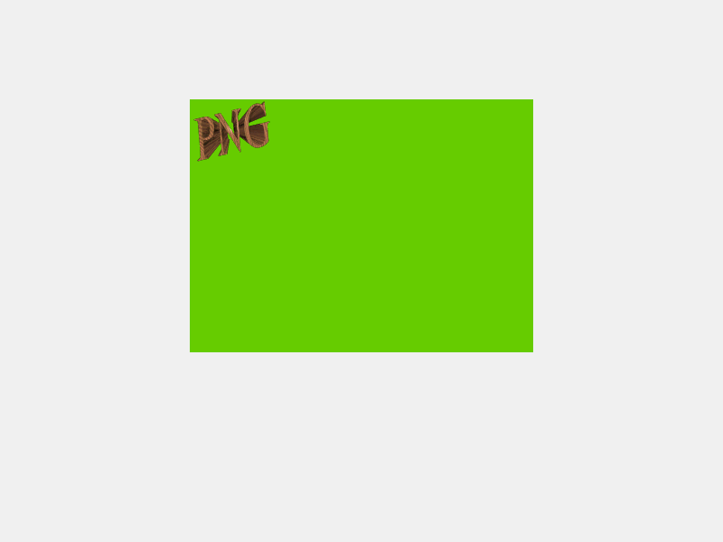
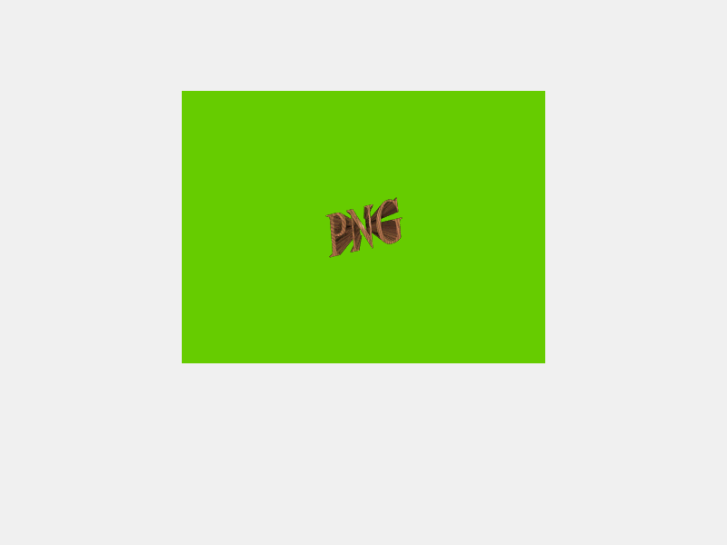
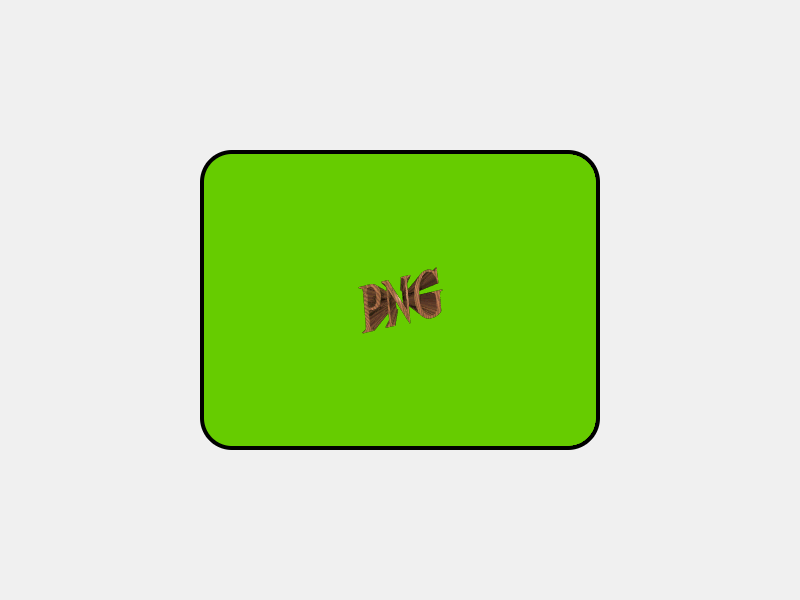
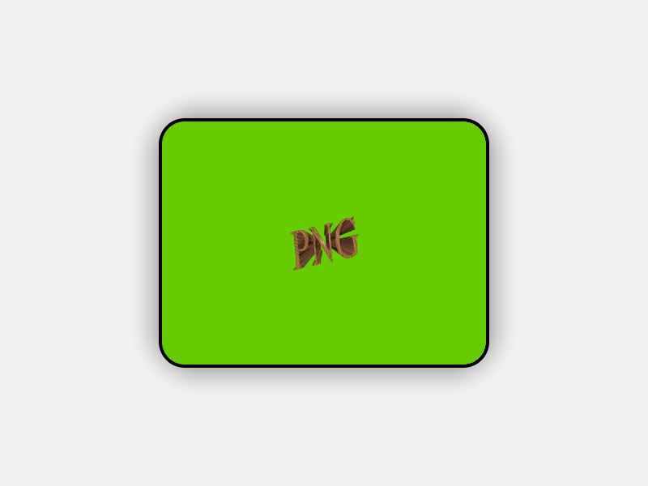

# 绘制复杂的图形

LCUI 实现了一些图形 API 用于解决组件的背景、边框和阴影的绘制问题。它们都依赖绘制上下文且都支持局部区域绘制，使得 LCUI 能够利用脏矩形机制和 OpenMP 并行渲染来提升渲染性能。

### 绘制背景

背景绘制参数被定义为`LCUI_Background` 结构体类型的对象，由 `Background_Paint()` 函数负责绘制。在下面的例子中，我们将画布中的区域 `(200, 100, 400, 30)` 作为背景区域，由于我们要让背景区域被完整绘制出来，所以又将该区域作为绘制区域。需要注意的是，背景区域和绘制都共用同一个原点，只有这两个区域相重叠部分才会被绘制出来。

```c
#include <LCUI.h>
#include <LCUI/graph.h>
#include <LCUI/image.h>
#include <LCUI/painter.h>

int main(void)
{
        LCUI_Graph canvas;
        LCUI_Color gray = RGB(240, 240, 240);
        LCUI_Color green = RGB(102, 204, 0);
        LCUI_Rect rect = { 200, 100, 400, 300 };
        LCUI_Background bg = { 0 };
        LCUI_PaintContext paint;

        Graph_Init(&canvas);
        Graph_Create(&canvas, 800, 600);
        Graph_FillRect(&canvas, gray, NULL, FALSE);
        // 设置背景色
        bg.color = green;
        // 创建绘制上下文
        paint = LCUIPainter_Begin(&canvas, &rect);
        // 绘制背景
        Background_Paint(&bg, &rect, paint);
        LCUI_WritePNGFile("test_paint_background_color.png", &canvas);
        LCUIPainter_End(paint);
        Graph_Free(&canvas);
        return 0;
}

```

运行结果：


#### 使用背景图

如果只是填充颜色的话，直接用 `Graph_FillRect()` 会更简单些，`Background_Paint()` 的核心功能是对背景图的处理，填充背景色只是它在绘制背景图前的一项准备工作。接下来我们通过加载背景图然后设置背景参数中的 `image` 和 `size` 成员变量来将背景图绘制到背景区域内：

```c
#include <LCUI.h>
#include <LCUI/graph.h>
#include <LCUI/image.h>
#include <LCUI/painter.h>

int main(void)
{
        LCUI_Graph canvas;
        LCUI_Graph image;
        LCUI_Color gray = RGB(240, 240, 240);
        LCUI_Color green = RGB(102, 204, 0);
        LCUI_Rect rect = { 200, 100, 400, 300 };
        LCUI_Background bg = { 0 };
        LCUI_PaintContext paint;

        Graph_Init(&canvas);
        Graph_Init(&image);
        Graph_Create(&canvas, 800, 600);
        Graph_FillRect(&canvas, gray, NULL, FALSE);
        // 读取背景图片
        if (LCUI_ReadImageFile("test_image_reader.png", &image) != 0) {
                return -1;
        }
        // 设置背景色
        bg.color = green;
        // 设置背景图
        bg.image = &image;
        bg.size.width = image.width;
        bg.size.height = image.height;
        // 创建绘制上下文
        paint = LCUIPainter_Begin(&canvas, &rect);
        // 绘制背景
        Background_Paint(&bg, &rect, paint);
        LCUI_WritePNGFile("test_paint_background_image.png", &canvas);
        LCUIPainter_End(paint);
        Graph_Free(&image);
        Graph_Free(&canvas);
        return 0;
}
```

运行结果：



#### 拉伸背景图

当背景图的尺寸与背景区域尺寸不同时，我们可以将背景图设置成与背景区域相同的宽高使背景图填满背景区域：

```c
#include <LCUI.h>
#include <LCUI/graph.h>
#include <LCUI/image.h>
#include <LCUI/painter.h>

int main(void)
{
        LCUI_Graph canvas;
        LCUI_Graph image;
        LCUI_Color gray = RGB(240, 240, 240);
        LCUI_Color green = RGB(102, 204, 0);
        LCUI_Rect rect = { 200, 100, 400, 300 };
        LCUI_Background bg = { 0 };
        LCUI_PaintContext paint;

        Graph_Init(&canvas);
        Graph_Init(&image);
        Graph_Create(&canvas, 800, 600);
        Graph_FillRect(&canvas, gray, NULL, FALSE);
        // 读取背景图片
        if (LCUI_ReadImageFile("test_image_reader.png", &image) != 0) {
                return -1;
        }
        // 设置背景色
        bg.color = green;
        // 设置背景图
        bg.image = &image;
        // 将背景图设置成与背景区域相同的尺寸
        bg.size.width = rect.width;
        bg.size.height = rect.height;
        // 创建绘制上下文
        paint = LCUIPainter_Begin(&canvas, &rect);
        // 绘制背景
        Background_Paint(&bg, &rect, paint);
        LCUI_WritePNGFile("test_paint_background_image_with_size.png", &canvas);
        LCUIPainter_End(paint);
        Graph_Free(&image);
        Graph_Free(&canvas);
        return 0;
}

```

运行结果：


#### 设置背景图位置

背景绘制参数中的 `position` 成员用于控制背景图的位置，这个例子中我们通过将位置设为背景图与背景区域的宽高差值的一半让背景图居中:

```c
#include <LCUI.h>
#include <LCUI/graph.h>
#include <LCUI/image.h>
#include <LCUI/painter.h>

int main(void)
{
        LCUI_Graph canvas;
        LCUI_Graph image;
        LCUI_Color gray = RGB(240, 240, 240);
        LCUI_Color green = RGB(102, 204, 0);
        LCUI_Rect rect = { 200, 100, 400, 300 };
        LCUI_Background bg = { 0 };
        LCUI_PaintContext paint;

        Graph_Init(&canvas);
        Graph_Init(&image);
        Graph_Create(&canvas, 800, 600);
        Graph_FillRect(&canvas, gray, NULL, FALSE);
        // 读取背景图片
        if (LCUI_ReadImageFile("test_image_reader.png", &image) != 0) {
                return -1;
        }
        // 设置背景色
        bg.color = green;
        // 设置背景图
        bg.image = &image;
        bg.size.width = image.width;
        bg.size.height = image.height;
        // 让背景图居中
        bg.position.x = (rect.width - image.width) / 2;
        bg.position.y = (rect.height - image.height) / 2;
        // 创建绘制上下文
        paint = LCUIPainter_Begin(&canvas, &rect);
        // 绘制背景
        Background_Paint(&bg, &rect, paint);
        LCUI_WritePNGFile("test_paint_background_image_with_position.png",
                          &canvas);
        LCUIPainter_End(paint);
        Graph_Free(&image);
        Graph_Free(&canvas);
        return 0;
}

```

运行结果：



### 绘制边框

边框绘制参数被定义为 `LCUI_Border` 结构体类型的对象，由 `Border_Paint()` 函数负责绘制。接下来我们基于上面的背景图例子继续添加用于绘制边框的代码，让背景区域被一个圆角边框包围。

圆角边框的绘制包含边框外部像素剔除操作，这个剔除操作本质上是将像素点的 alpha 值设置为 0，也就是让像素点透明，这意味着：

* 如果直接基于画布绘制的话，画布内的部分区域也会剔除。
* 承载绘制结果的图形对象的色彩类型必须是 `LCUI_COLOR_TYPE_ARGB`。

因此，我们新建了一个名为 `layer`的图形对象，将它的色彩类型设置为 `LCUI_COLOR_TYPE_ARGB`，充当临时画布来存储背景和边框的绘制结果，然后基于它创建绘制上下文。由于边框的宽高依赖于背景的宽高，我们重新定义了背景区域和边框区域，使得背景区域能够由边框区域和边框线的大小计算而来。在绘制完后，调用 `Graph_Mix()` 函数将它混合到画布中。

```c
#include <LCUI.h>
#include <LCUI/graph.h>
#include <LCUI/image.h>
#include <LCUI/painter.h>

int paint_background(LCUI_PaintContext paint, LCUI_Rect *box)
{
        LCUI_Graph image;
        LCUI_Color green = RGB(102, 204, 0);
        LCUI_Background bg = { 0 };

        Graph_Init(&image);
        // 读取背景图片
        if (LCUI_ReadImageFile("test_image_reader.png", &image) != 0) {
                return -1;
        }
        // 设置背景色
        bg.color = green;
        // 设置背景图
        bg.image = &image;
        bg.size.width = image.width;
        bg.size.height = image.height;
        // 让背景图居中
        bg.position.x = (box->width - image.width) / 2;
        bg.position.y = (box->height - image.height) / 2;
        // 绘制背景
        Background_Paint(&bg, box, paint);
        Graph_Free(&image);
        return 0;
}

void paint_border(LCUI_PaintContext paint, LCUI_Rect *box)
{
        LCUI_Border border = { 0 };
        LCUI_Color black = RGB(0, 0, 0);

        border.top.color = black;
        border.top.style = SV_SOLID;
        border.top.width = 4;
        border.right.color = black;
        border.right.style = SV_SOLID;
        border.right.width = 4;
        border.bottom.color = black;
        border.bottom.style = SV_SOLID;
        border.bottom.width = 4;
        border.left.color = black;
        border.left.style = SV_SOLID;
        border.left.width = 4;
        border.top_left_radius = 32;
        border.top_right_radius = 32;
        border.bottom_left_radius = 32;
        border.bottom_right_radius = 32;
        Border_Paint(&border, box, paint);
}

int main(void)
{
        int border_size = 4;

        LCUI_Graph canvas;
        LCUI_Graph layer;
        LCUI_Color gray = RGB(240, 240, 240);
        LCUI_Rect border_box = { 0, 0, 400, 300 };
        LCUI_Rect bg_box = { border_box.x + border_size,
                             border_box.y + border_size,
                             border_box.width - border_size * 2,
                             border_box.height - border_size * 2 };
        LCUI_Rect layer_rect = { 0, 0, border_box.width, border_box.height };
        LCUI_PaintContext paint;

        Graph_Init(&canvas);
        Graph_Create(&canvas, 800, 600);
        Graph_FillRect(&canvas, gray, NULL, FALSE);

        Graph_Init(&layer);
        layer.color_type = LCUI_COLOR_TYPE_ARGB;
        Graph_Create(&layer, layer_rect.width, layer_rect.height);

        // 创建绘制上下文
        paint = LCUIPainter_Begin(&layer, &layer_rect);
        paint->with_alpha = TRUE;
        paint_background(paint, &bg_box);
        paint_border(paint, &border_box);
        Graph_Mix(&canvas, &layer, (canvas.width - layer_rect.width) / 2,
                  (canvas.height - layer_rect.height) / 2, FALSE);
        LCUI_WritePNGFile("test_paint_border.png", &canvas);
        Graph_Free(&canvas);
        return 0;
}

```



### 绘制阴影

阴影绘制参数被定义为 `LCUI_BoxShadow` 结构体类型的对象，由 `BoxShadow_GetCanvasRect()` 函数负责计算指定区域在添加阴影后的区域、`BoxShadow_Paint()` 函数负责绘制。

继续基于上个例子，我们再添加阴影的绘制代码。与边框的绘制方法类似，阴影区域需要由边框区域和阴影参数计算而来，因此我们又调整了背景、边框和阴影的区域定义代码，然后按照背景 -&gt; 边框 -&gt; 阴影的顺序计算各个区域。如果你看过[布局](../layout/box-model.md)章节中对盒模型的介绍，你会发现这一系列的区域计算就是在计算盒子模型。

```c
#include <LCUI.h>
#include <LCUI/graph.h>
#include <LCUI/image.h>
#include <LCUI/painter.h>

int paint_background(LCUI_PaintContext paint, LCUI_Rect *box)
{
        LCUI_Graph image;
        LCUI_Color green = RGB(102, 204, 0);
        LCUI_Background bg = { 0 };

        Graph_Init(&image);
        // 读取背景图片
        if (LCUI_ReadImageFile("test_image_reader.png", &image) != 0) {
                return -1;
        }
        // 设置背景色
        bg.color = green;
        // 设置背景图
        bg.image = &image;
        bg.size.width = image.width;
        bg.size.height = image.height;
        // 让背景图居中
        bg.position.x = (box->width - image.width) / 2;
        bg.position.y = (box->height - image.height) / 2;
        // 绘制背景
        Background_Paint(&bg, box, paint);
        Graph_Free(&image);
        return 0;
}

void paint_border(LCUI_PaintContext paint, LCUI_Rect *box, int size, int radius)
{
        LCUI_Border border = { 0 };
        LCUI_Color black = RGB(0, 0, 0);

        border.top.color = black;
        border.top.style = SV_SOLID;
        border.top.width = size;
        border.right.color = black;
        border.right.style = SV_SOLID;
        border.right.width = size;
        border.bottom.color = black;
        border.bottom.style = SV_SOLID;
        border.bottom.width = size;
        border.left.color = black;
        border.left.style = SV_SOLID;
        border.left.width = size;
        border.top_left_radius = radius;
        border.top_right_radius = radius;
        border.bottom_left_radius = radius;
        border.bottom_right_radius = radius;
        Border_Paint(&border, box, paint);
}

int main(void)
{
        int border_size = 4;
        int border_radius = 32;
        int width = 800;
        int height = 600;

        LCUI_Graph canvas;
        LCUI_Graph layer;
        LCUI_Color gray = RGB(240, 240, 240);
        LCUI_BoxShadow shadow = { .x = 0,
                                  .y = 0,
                                  .blur = 40,
                                  .spread = 0,
                                  .color = ARGB(150, 0, 0, 0),
                                  .top_left_radius = border_radius,
                                  .top_right_radius = border_radius,
                                  .bottom_left_radius = border_radius,
                                  .bottom_right_radius = border_radius };
        LCUI_Rect shadow_box;
        LCUI_Rect border_box;
        LCUI_Rect bg_box;
        LCUI_Rect layer_rect;
        LCUI_PaintContext paint;

        Graph_Init(&canvas);
        Graph_Create(&canvas, width, height);
        Graph_FillRect(&canvas, gray, NULL, FALSE);

        // 设置居中的背景区域
        bg_box.width = 400;
        bg_box.height = 300;
        bg_box.x = (width - bg_box.width) / 2;
        bg_box.y = (height - bg_box.height) / 2;
        // 基于背景区域，计算边框区域
        border_box.x = bg_box.x - border_size;
        border_box.y = bg_box.y - border_size;
        border_box.width = bg_box.width + border_size * 2;
        border_box.height = bg_box.height + border_size * 2;
        // 基于边框区域，计算阴影区域
        BoxShadow_GetCanvasRect(&shadow, &border_box, &shadow_box);

        // 创建一个临时绘制层
        Graph_Init(&layer);
        layer_rect.x = 0;
        layer_rect.y = 0;
        layer_rect.width = shadow_box.width;
        layer_rect.height = shadow_box.height;
        layer.color_type = LCUI_COLOR_TYPE_ARGB;
        Graph_Create(&layer, layer_rect.width, layer_rect.height);

        // 基于临时绘制层创建绘制上下文
        paint = LCUIPainter_Begin(&layer, &layer_rect);
        paint->with_alpha = TRUE;
        // 将背景区域和边框区域的坐标转换成相对于阴影区域
        bg_box.x -= shadow_box.x;
        bg_box.y -= shadow_box.y;
        border_box.x -= shadow_box.x;
        border_box.y -= shadow_box.y;
        paint_background(paint, &bg_box);
        paint_border(paint, &border_box, border_size, border_radius);
        BoxShadow_Paint(&shadow, &layer_rect, border_box.width,
                        border_box.height, paint);

        // 将临时绘制层混合到画布中
        Graph_Mix(&canvas, &layer, shadow_box.x, shadow_box.y, FALSE);
        LCUI_WritePNGFile("test_paint_boxshadow.png", &canvas);
        Graph_Free(&canvas);
        return 0;
}

```

运行结果：



### 待办事项

**添加样式转绘制参数的函数**

从上面的绘制背景图的示例代码中我们可以看出像位置、尺寸这类参数都要我们编写代码去计算，而且需要些很多行代码去逐个设置属性，要是能用 css 代码描述的话会方便很多。因此，我们需要一个函数能够读取样式表中的 `background-` 开头的属性然后输出成`LCUI_Background` 类型的对象。

