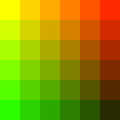
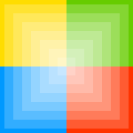
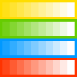

# 绘制图形

### 绘制矩形 <a id="&#x7ED8;&#x5236;&#x77E9;&#x5F62;"></a>

与其它图形库不同，LCUI 提供的图形 API 只支持矩形这一种形式的图形绘制，不支持基于路径来绘制复杂图形。因此，对于其它复杂的图形，你需要手动编写代码填充像素来绘制。

LCUI 提供了一种方法绘制矩形：

```c
int Graph_FillRect(LCUI_Graph *graph, LCUI_Color color,
                   LCUI_Rect *rect, LCUI_BOOL with_alpha);
```


注意，该函数会将指定区域内的像素替换为指定颜色，而不是与原有颜色混合。


现在就来使用这个函数：

```c
#include <LCUI.h>
#include <LCUI/graph.h>
#include <LCUI/image.h>

int main(void)
{
        int i, j;
        LCUI_Graph canvas;
        LCUI_Color color;
        LCUI_Rect rect;

        Graph_Init(&canvas);
        Graph_Create(&canvas, 150, 150);
        for (i = 0; i < 6; ++i) {
                for (j = 0; j < 6; ++j) {
                        color.red = (unsigned char)(255 - 42.5 * i);
                        color.green = (unsigned char)(255 - 42.5 * j);
                        color.blue = 0;
                        rect.x = j * 25;
                        rect.y = i * 25;
                        rect.width = 25;
                        rect.height = 25;
                        Graph_FillRect(&canvas, color, &rect, FALSE);
                }
        }
        LCUI_WritePNGFile("test_fill_rect.png", &canvas);
        Graph_Free(&canvas);
        return 0;
}

```

在本示例里，我们用两层 `for` 循环来绘制方阵列，每个方格不同的颜色。结果如下图，但实现所用的代码却没那么绚丽。我们用了两个变量 `i` 和 `j` 来为每一个方格产生唯一的 RGB 色彩值，其中仅修改红色和绿色通道的值，而保持蓝色通道的值不变。你可以通过修改这些颜色通道的值来产生各种各样的色板。通过增加渐变的频率，你还可以绘制出类似 Photoshop 里面的那样的调色板。



### 透明度

除了可以绘制实色图形，我们还可以绘制半透明的图形。通过设置画布的 opacity 属性或使用一个半透明颜色作为填充颜色。

opacity 属性影响整个画布的透明度，有效的取值范围是 0.0（完全透明）到 1.0（完全不透明），默认是 1.0。

#### opacity 的使用示例

在这个例子里，我们使用两个画布，一个填充四色格作为背景，另一个用作前景，设置其 `opacity` 属性为 `0.2`，然后再上面画一系列尺寸递增的把他们矩形。最终结果是一个径向渐变效果。矩形叠加得越更多，原先所画的矩形的透明度会越低。通过增加循环次数，画更多的矩形，从中心到边缘部分，背景图会呈现逐渐消失的效果。

```c
#include <LCUI.h>
#include <LCUI/graph.h>
#include <LCUI/image.h>

int main(void)
{
        int i, size;
        LCUI_Graph canvas;
        LCUI_Graph fore_canvas;
        LCUI_Rect rect;

        Graph_Init(&canvas);
        Graph_Init(&fore_canvas);
        Graph_Create(&canvas, 150, 150);
        // 画背景
        rect.x = 0;
        rect.y = 0;
        rect.width = 75;
        rect.height = 75;
        Graph_FillRect(&canvas, RGB(255, 221, 0), &rect, FALSE);
        rect.x = 75;
        Graph_FillRect(&canvas, RGB(102, 204, 0), &rect, FALSE);
        rect.x = 0;
        rect.y = 75;
        Graph_FillRect(&canvas, RGB(0, 153, 255), &rect, FALSE);
        rect.x = 75;
        Graph_FillRect(&canvas, RGB(255, 51, 0), &rect, FALSE);
        // 设置前景的 opacity 值
        fore_canvas.opacity = 0.2f;
        // 仅当色彩模式为 ARGB 时 opacity 属性才会生效
        fore_canvas.color_type = LCUI_COLOR_TYPE_ARGB;
        for (i = 0; i < 7; ++i) {
                size = 2 * (10 + 10 * i);
                // 使用新尺寸重新创建前景图
                Graph_Create(&fore_canvas, size, size);
                // 重新填充颜色
                Graph_FillRect(&fore_canvas, RGB(255, 255, 255), NULL, TRUE);
                // 将前景图混合到背景图中
                Graph_Mix(&canvas, &fore_canvas, 75 - size / 2, 75 - size / 2, FALSE);
        }
        LCUI_WritePNGFile("test_mix_rect_with_opacity.png", &canvas);
        Graph_Free(&fore_canvas);
        Graph_Free(&canvas);
        return 0;
}

```



#### 半透明色的使用示例

```c
#include <LCUI.h>
#include <LCUI/graph.h>
#include <LCUI/image.h>
#include <stdio.h>

int main(void)
{
        int i, j;
        LCUI_Graph canvas;
        LCUI_Graph fore_canvas;
        LCUI_Color color;
        LCUI_Rect rect;

        Graph_Init(&canvas);
        Graph_Init(&fore_canvas);
        Graph_Create(&canvas, 160, 160);
        // 画背景
        rect.x = 0;
        rect.y = 0;
        rect.width = 160;
        rect.height = 40;
        Graph_FillRect(&canvas, RGB(255, 221, 0), &rect, FALSE);
        rect.y += 40;
        Graph_FillRect(&canvas, RGB(102, 204, 0), &rect, FALSE);
        rect.y += 40;
        Graph_FillRect(&canvas, RGB(0, 153, 255), &rect, FALSE);
        rect.y += 40;
        Graph_FillRect(&canvas, RGB(255, 51, 0), &rect, FALSE);
        color.red = 255;
        color.green = 255;
        color.blue = 255;
        fore_canvas.color_type = LCUI_COLOR_TYPE_ARGB;
        Graph_Create(&fore_canvas, 15, 30);
        // 画半透明矩形
        for (i = 0; i < 10; ++i) {
                color.alpha = (unsigned char)(255 * (i + 1) / 10.0);
                Graph_FillRect(&fore_canvas, color, NULL, TRUE);
                for (j = 0; j < 4; ++j) {
                        Graph_Mix(&canvas, &fore_canvas, 5 + i * 15, 5 + j * 40, TRUE);
                }
        }
        LCUI_WritePNGFile("test_fill_rect_with_rgba.png", &canvas);
        Graph_Free(&fore_canvas);
        Graph_Free(&canvas);
        return 0;
}

```



### 绘制背景

LCUI 将组件的背景绘制参数抽象成了 `LCUI_Background` 结构体类型的对象，并由 `Background_Paint()` 进行绘制。

现在就使用它在指定区域内填充绿色作为背景色：

```c
#include <LCUI.h>
#include <LCUI/graph.h>
#include <LCUI/image.h>
#include <LCUI/painter.h>

int main(void)
{
        LCUI_Graph canvas;
        LCUI_Color gray = { .value = 0xfff0f0f0 };
        LCUI_Color green = { .r = 102, .g = 204, .b = 0 };
        LCUI_Rect rect = { 200, 100, 400, 300 };
        LCUI_Background bg = { 0 };
        LCUI_PaintContext paint;

        Graph_Init(&canvas);
        Graph_Create(&canvas, 800, 600);
        Graph_FillRect(&canvas, gray, NULL, FALSE);
        // 设置背景色
        bg.color = green;
        // 创建绘制上下文
        paint = LCUIPainter_Begin(&canvas, &rect);
        // 绘制背景
        Background_Paint(&bg, &rect, paint);
        LCUI_WritePNGFile("test_paint_background_color.png", &canvas);
        LCUIPainter_End(paint);
        Graph_Free(&canvas);
        return 0;
}

```

示例中将画布中的区域 `(200, 100, 400, 30)` 作为背景区域，由于我们要让背景区域被完整绘制出来，所以又将该区域作为绘制区域。需要注意的是，背景区域和绘制都共用同一个原点，只有这两个区域相重叠部分才会被绘制出来。

运行结果：


#### 使用背景图

只是填充颜色的话直接用 `Graph_FillRect()` 更简单些，接下来我们在背景区域内添加一张图片：

```c
#include <LCUI.h>
#include <LCUI/graph.h>
#include <LCUI/image.h>
#include <LCUI/painter.h>

int main(void)
{
        LCUI_Graph canvas;
        LCUI_Graph image;
        LCUI_Color gray = { .value = 0xfff0f0f0 };
        LCUI_Color green = { .r = 102, .g = 204, .b = 0 };
        LCUI_Rect rect = { 200, 100, 400, 300 };
        LCUI_Background bg = { 0 };
        LCUI_PaintContext paint;

        Graph_Init(&canvas);
        Graph_Init(&image);
        Graph_Create(&canvas, 800, 600);
        Graph_FillRect(&canvas, gray, NULL, FALSE);
        // 读取背景图片
        if (LCUI_ReadImageFile("test_image_reader.png", &image) != 0) {
                return -1;
        }
        // 设置背景色
        bg.color = green;
        // 设置背景图
        bg.image = &image;
        bg.size.width = image.width;
        bg.size.height = image.height;
        // 创建绘制上下文
        paint = LCUIPainter_Begin(&canvas, &rect);
        // 绘制背景
        Background_Paint(&bg, &rect, paint);
        LCUI_WritePNGFile("test_paint_background_image.png", &canvas);
        LCUIPainter_End(paint);
        Graph_Free(&image);
        Graph_Free(&canvas);
}
```


#### 拉伸背景图

当背景图的尺寸与背景区域尺寸不同时，我们可以通过设置宽高属性来让背景图填满背景区域：

```c
#include <LCUI.h>
#include <LCUI/graph.h>
#include <LCUI/image.h>
#include <LCUI/painter.h>

int main(void)
{
        LCUI_Graph canvas;
        LCUI_Graph image;
        LCUI_Color gray = { .value = 0xfff0f0f0 };
        LCUI_Color green = { .r = 102, .g = 204, .b = 0 };
        LCUI_Rect rect = { 200, 100, 400, 300 };
        LCUI_Background bg = { 0 };
        LCUI_PaintContext paint;

        Graph_Init(&canvas);
        Graph_Init(&image);
        Graph_Create(&canvas, 800, 600);
        Graph_FillRect(&canvas, gray, NULL, FALSE);
        // 读取背景图片
        if (LCUI_ReadImageFile("test_image_reader.png", &image) != 0) {
                return -1;
        }
        // 设置背景色
        bg.color = green;
        // 设置背景图
        bg.image = &image;
        // 将背景图设置成与背景区域相同的尺寸
        bg.size.width = rect.width;
        bg.size.height = rect.height;
        // 创建绘制上下文
        paint = LCUIPainter_Begin(&canvas, &rect);
        // 绘制背景
        Background_Paint(&bg, &rect, paint);
        LCUI_WritePNGFile("test_paint_background_image_with_size.png", &canvas);
        LCUIPainter_End(paint);
        Graph_Free(&image);
        Graph_Free(&canvas);
        return 0;
}

```


#### 设置背景图位置

```c
#include <LCUI.h>
#include <LCUI/graph.h>
#include <LCUI/image.h>
#include <LCUI/painter.h>

int main(void)
{
        LCUI_Graph canvas;
        LCUI_Graph image;
        LCUI_Color gray = { .value = 0xfff0f0f0 };
        LCUI_Color green = { .r = 102, .g = 204, .b = 0 };
        LCUI_Rect rect = { 200, 100, 400, 300 };
        LCUI_Background bg = { 0 };
        LCUI_PaintContext paint;

        Graph_Init(&canvas);
        Graph_Init(&image);
        Graph_Create(&canvas, 800, 600);
        Graph_FillRect(&canvas, gray, NULL, FALSE);
        // 读取背景图片
        if (LCUI_ReadImageFile("test_image_reader.png", &image) != 0) {
                return -1;
        }
        // 设置背景色
        bg.color = green;
        // 设置背景图
        bg.image = &image;
        bg.size.width = image.width;
        bg.size.height = image.height;
        // 让背景图居中
        bg.position.x = (rect.width - image.width) / 2;
        bg.position.y = (rect.height - image.height) / 2;
        // 创建绘制上下文
        paint = LCUIPainter_Begin(&canvas, &rect);
        // 绘制背景
        Background_Paint(&bg, &rect, paint);
        LCUI_WritePNGFile("test_paint_background_image_with_position.png", &canvas);
        LCUIPainter_End(paint);
        Graph_Free(&image);
        Graph_Free(&canvas);
        return 0;
}

```


### 绘制边框

### 绘制圆形

### 绘制阴影

待办事项

**添加样式转绘制参数的函数**

从上面的绘制背景图的示例代码中我们可以看出像位置、尺寸这类参数都要我们编写代码去计算，要是能用 css 代码描述的话会方便很多，因此，我们需要一个函数能够读取样式表中的 `background-` 开头的属性然后输出成`LCUI_Background` 类型的对象。

