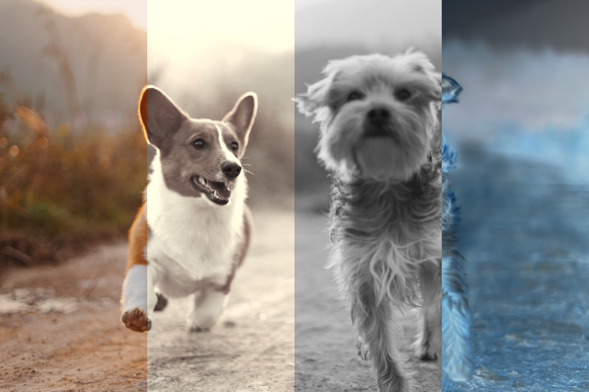

# 像素操作

在前面我们已经了解到图像的数据结构、栅格、坐标系和坐标转下标的方法，仅凭 LCUI 提供的这点图形 API 无法让我们轻松绘制复杂的图形，所以我们有必要学会如何操作像素数据，以便自己手动编码或借助其它图形库的能力来绘制图形。


注意，虽然像素数据的类型名是 `LCUI_ARGB`，但这些颜色通道的值在内存中存储的顺序是 BGRA。之所以采用这种顺序，是因为 Linux 中的帧缓存（FrameBuffer） 和 Windows 中的位图对象（HBITMAP） 都是这样。


### 图片灰度和反相颜色

在这个例子里，我们将图片分成四个部分，其中三个分别进行反色（inverted）、灰度（grayscale）、褐色（sepia）处理，然后将处理结果输出到图片文件中。`invert()` 函数将颜色的最大色值 255 减去像素的色值作为结果，`grayscale()` 函数将红绿蓝三色值的平均值作为结果，你也可以用加权平均，例如 `x = 0.299r + 0.587g + 0.114b` 这个公式，更多资料请参考维基百科的 [Grayscale](http://en.wikipedia.org/wiki/Grayscale)。`sepia()` 函数与 `grayscale()` 函数采用了类似的算法。

像素操作的流程是相似的，先使用两层 for 循环在指定区域内定位要操作的像素点，然后获取像素数据进行处理，之后写入数据到图像中。为了减少代码量，我们将重复的代码定义成 `PixelManipulationBegin` 宏和 `PixelManipulationEnd` 宏，其中像素操作用到`GraphGetPixel()` 和 `GraphSetPixel()` 是函数式宏，它封装了坐标转下标的计算代码，使得我们无需再编写冗长的代码，但需要注意的是，它会为每个像素点计算下标，而这计算中包含重复计算，所以效率比较低，如果你在实际项目中比较注重性能的话可以做一点优化，例如在 y 轴的循环里提前计算每行起点下标：`row_start = y * graph.width + rect.x`。

```c
#include <math.h>
#include <LCUI.h>
#include <LCUI/image.h>

#define PixelManipulationBegin                                   \
        int x, y;                                                \
        LCUI_Color pixel;                                        \
                                                                 \
        for (y = rect.y; y < rect.y + rect.height; ++y) {        \
                for (x = rect.x; x < rect.x + rect.width; ++x) { \
                        Graph_GetPixel(graph, x, y, pixel);

#define PixelManipulationEnd                \
        Graph_SetPixel(graph, x, y, pixel); \
        }                                   \
        }

void invert(LCUI_Graph *graph, LCUI_Rect rect)
{
        PixelManipulationBegin;
        pixel.red = (unsigned char)(255 - pixel.red);
        pixel.green = (unsigned char)(255 - pixel.green);
        pixel.blue = (unsigned char)(255 - pixel.blue);
        PixelManipulationEnd;
}

void grayscale(LCUI_Graph *graph, LCUI_Rect rect)
{
        unsigned char avg;

        PixelManipulationBegin;
        avg = (unsigned char)((pixel.red + pixel.green + pixel.blue) / 3);
        pixel.red = avg;
        pixel.green = avg;
        pixel.blue = avg;
        PixelManipulationEnd;
}

void sepia(LCUI_Graph *graph, LCUI_Rect rect)
{
        PixelManipulationBegin;
        pixel.red = (unsigned char)min(
            round(0.393 * pixel.red + 0.769 * pixel.green + 0.189 * pixel.blue),
            255);
        pixel.green = (unsigned char)min(
            round(0.349 * pixel.red + 0.686 * pixel.green + 0.168 * pixel.blue),
            255);
        pixel.blue = (unsigned char)min(
            round(0.272 * pixel.red + 0.534 * pixel.green + 0.131 * pixel.blue),
            255);
        PixelManipulationEnd;
}

int main(void)
{
        int i;
        LCUI_Graph graph = { 0 };
        LCUI_Rect rects[4];

        if (LCUI_ReadImageFile("dog.jpg", &graph) != 0) {
                return -1;
        }
        for (i = 0; i < 4; ++i) {
                rects[i].height = graph.height;
                rects[i].width = graph.width / 4;
                rects[i].x = i * rects[i].width;
                rects[i].y = 0;
        }
        sepia(&graph, rects[1]);
        grayscale(&graph, rects[2]);
        invert(&graph, rects[3]);
        LCUI_WritePNGFile("test_pixel_manipulation.png", &graph);
        return 0;
}

```

源图片：


处理结果（原始，褐色，灰度，反色）：



