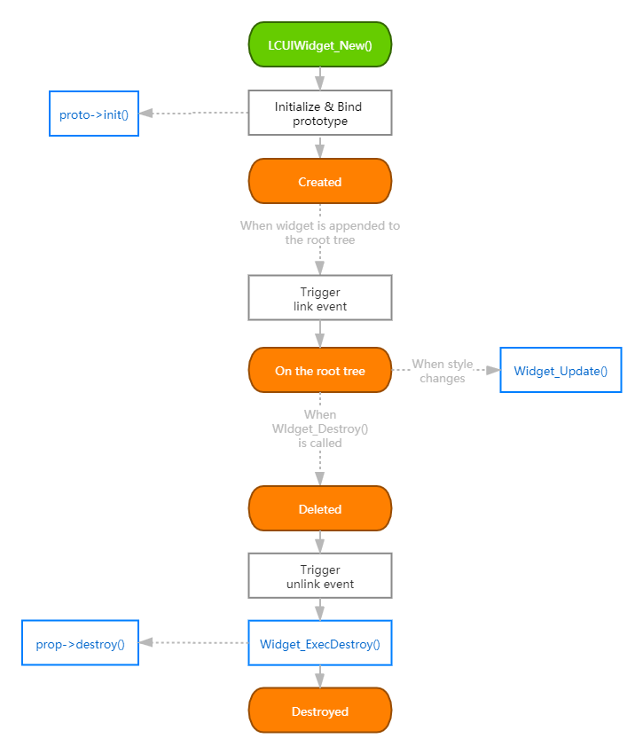
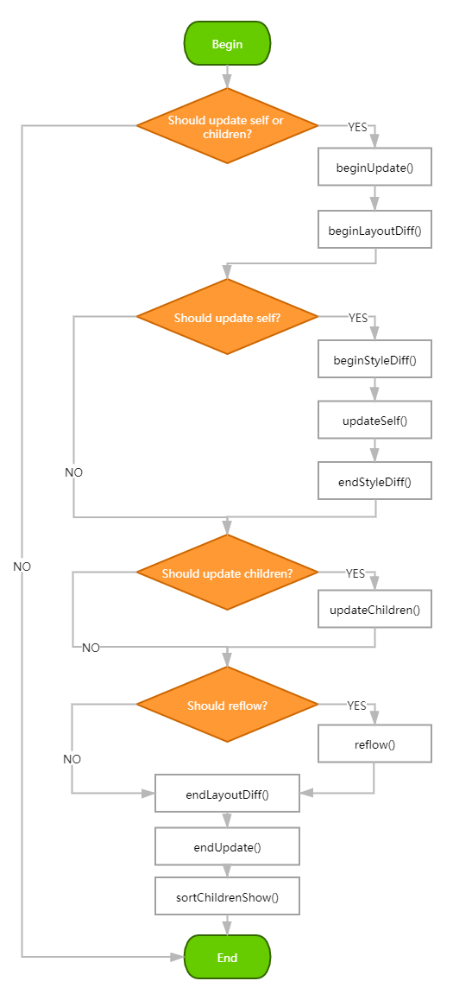

# 生命周期

### 概览

组件的生命周期分为三个阶段：挂载、渲染、卸载，下图展示了解组件在整个生命周期中所涉及到的方法调用、原型方法调用和状态变化。

### 挂载阶段

从组件实例被创建再到被插入根组件树中，所经历的操作如下：

* 初始化组件实例。
* 根据组件类型绑定对应的原型。
* 调用 `proto->init()` 原型方法。
* 标记组件需要刷新全部样式。
* 因父组件变为另外一个组件，触发 link 事件。

### 更新阶段

当组件被插入到根组件树中后，在主循环中运行的组件更新机制会负责它的更新，每当样式发生变化时都会触发更新，相关操作的执行顺序如下：

* 创建更新上下文。
  * 遍历父级组件的更新上下文，如果里面有样式缓存则使用它。
  * 如果有样式缓存且组件自身有设置样式特征码，则以该特征码作为索引键直接从缓存中获取匹配的样式表，否则为组件生成临时的样式选择器然后从全局样式缓存查询匹配的样式。
* 初始化更新上下文中的布局差异对比缓存。
* 如果被标记为需要更新自身。
  * 初始化更新上下文中的样式对比缓存。
  * 遍历任务列表，更新自身样式。
  * 对比更新前后的样式，根据对比结果来决定是否需要标记无效区域、触发自身重新布局、触发父组件重新布局。
* 如果需要更新子组件，则遍历子组件列表为每个子组件跑一遍上述流程。
* 对比更新前后的布局差异，根据自身的位置和尺寸的变化情况来决定是否需要标记无效区域、触发父组件的重新布局。
* 结束更新，销毁更新上下文。
* 更新子组件的显示顺序。

整个更新流程如下图所示：

### 卸载阶段

当调用 `Widget_Destroy()` 函数销毁组件时，组件会被移动到垃圾列表中等待删除。这个阶段内的相关操作的执行顺序如下：

* 组件状态被切换为 `DELETED` 。
* 从父组件的子组件列表中移除自己，触发 unlink 事件。
* 追加到垃圾列表中。
* 销毁组件的子组件列表。
* 清除原型数据，这时会调用 `proto->destroy()` 原型方法。
* 销毁组件实例。


垃圾列表中的组件会在这一帧内所有组件更新完后被删除。采用延迟批量删除组件的目的是为了应对同一帧内还有其它事件和定时器的处理器需要操作该组件的情况。


### 状态

组件的状态共有以下几种：

* **CREATED:** 组件创建后的初始状态。
* **UPDTED:** 组件经第一次更新后。
* **LAYOUTED:** 组件经第一次布局后。
* **READY:** 组件已更新且已被布局。这时会触发 READY 事件并直接切换到 NORMAL 状态。在 READY 状态之前，组件的位置和尺寸都是不准确的，如果你组件的一些操作依赖这些属性，例如：在初次显示时将组件定位在另一个组件的附近，则可以将之放到 READY 事件处理器中。
* **NORMAL:** 组件正常可用。
* **DELETED:** 组件已从根组件树中删除，即将被销毁。

其中 LAYOUTED 和 READY 是过渡状态，与组件当前状态混合后会变为下一个状态。

### 待办事项

**重新设计组件生命周期**

考虑以下问题：

* link 和 unlink 事件似乎用处不大，是否需要移除？
* 生命周期中的某些阶段是通过触发事件来通知组件的，是否需要统一成函数调用？
* 是否需要添加更多的生命周期方法？例如：`Mounted()` 和 `BeforeUnmount()`

