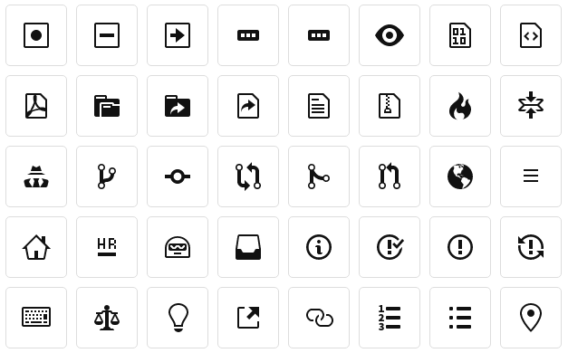

## 图标字体

图标在图形界面中很常见，以往的软件界面中的图标都是一张张位图，颜色和大小都是固定的，如果想让图标颜色能够根据状态来变化，还要多准备几张位图，按钮就是个典型的例子，它有正常、高亮、按下、禁用这几种状态，一旦按钮多起来的话也不好处理，而且搜集图标也比较麻烦，还需要风格统一。

在扁平化设计流行的今天，扁平风格的图标是必不可少的，图标字体能够通过 color 和 font-size 属性设置任何颜色和大小，具备良好的灵活性，在很多网站和手机应用程序的界面中都有应用。图标字体本质上也是字体，常见的文字字体是一个 unicode 码（字符码）对应一个字形，而图标字体是一个 unicode 码对应一个图标。



通常在程序中直接使用图标字体需要先查找图标对应的 unicode 码然后写在代码里，虽然可以靠宏定义代替图标的 unicode 码来提升代码可读性，但这种做法依然比较麻烦。幸好 LCUI 支持 CSS，我们可以靠预先定义在 CSS 代码中的样式类（class）来使用图标，图标样式类相比于 unicode 码语意明确，书写更直观，可以很容易分辨这个图标大致是什么内容，并且在向图标字体增加新图标后只需要更新 CSS 代码。

常见的图标字体有 [FontAwesome](http://fontawesome.io/icons/) 和 [Material Design Icons](https://materialdesignicons.com/)，如果觉得这些图标不够用，或者用不到这么多图标想精简体积，可以试试在线图标打包服务，例如：[Iconmoon](https://icomoon.io/)、[阿里巴巴矢量图标库](http://www.iconfont.cn/)。

以 FontAwesome 为例，从它的官方网站上下载压缩包，解压后打开其中的 `css/font-awesome.css` 文件，内容大致如下：

``` css
@font-face {
  font-family: 'FontAwesome';
  ...
}
.fa {
	...
}
...
.fa-search:before {
  content: "\f002";
}
.fa-heart:before {
  content: "\f004";
}
.fa-star:before {
  content: "\f005";
}
.fa-user:before {
  content: "\f007";
}
...
```

以上 css 代码在 LCUI 中并不起作用，需要做些修改，删除掉多余的样式，保留选择器以 `.fa-` 开头且只有 content 属性的样式表，然后删除 `:before` 伪类，修改后的内容大致如下：

``` css
.fa {
  font-family: 'FontAwesome';
}
...
.fa-search {
  content: "\f002";
}
.fa-heart {
  content: "\f004";
}
.fa-star {
  content: "\f005";
}
.fa-user {
  content: "\f007";
}
...
```

之后将 font-awesome.css 和 fontawesome-webfont.ttf 文件复制到应用程序的目录下，并在应用程序中引入它们。引入方式有两种，一种是写在 xml 文件里，另一种是直接在应用程序代码中引入。

``` xml
<?xml version="1.0" encoding="UTF-8" ?>
<lcui-app>
  <resource type="text/css" src="font-awesome.css"/>
  <resource type="application/font-ttf" src="fontawesome-webfont.ttf"/>
  <ui>
  	...
  </ui>
</lcui-app>
```

``` c
...
#include <LCUI/font.h>
...
        LCUIFont_LoadFile( "fontawesome-webfont.ttf" );
        LCUI_LoadCSSFile( "font-awesome.css" );
...

```

引入后，用 textview 部件呈现图标，通过设置样式类控制它呈现何种图标。

``` c
        LCUI_Widget icon = LCUIWidget_New( NULL );
        Widget_AddClass("fa fa-bicycle"); // 自行车
        Widget_AddClass("fa fa-car"); // 汽车
        Widget_AddClass("fa fa-taxi"); // 出租车
        Widget_AddClass("fa fa-ship"); // 船
        Widget_AddClass("fa fa-plane"); // 飞机
```

想知道这些图标的具体效果的话，可以到该字体图标的官网上预览。

(未完待续...)
