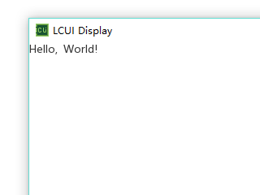

# 一个最小的应用

按常规套路，第一个程序从输出 "Hello, World!" 开始，那么首先，你需要新建一个 helloworld.c 文件，写好 main\(\) 函数，然后引入 LCUI 的基础头文件：

```c
#include <LCUI_Build.h>
#include <LCUI/LCUI.h>

int main(void)
{
        return 0;
}
```

LCUI\_Build.h 中主要包含 LCUI 在编译时的相关宏定义，而 LCUI.h 中主要包含 LCUI 应用程序必要的数据结构定义以及常用函数声明。

接下来，需要一个容器能够装载 "Hello, World!" 字符串并将它呈现在屏幕上。为了实现这一功能，我们可以使用 LCUI 自带的文本显示（TextView）部件来扮演容器这一角色，但在此之前，我们需要引入依赖的头文件：

```c
#include <LCUI/gui/widget.h>
#include <LCUI/gui/widget/textview.h>
```

在使用 LCUI 的功能前，我们需要调用 `LCUI_Init()` 对各个功能进行初始化：

```c
...
int main(void)
{
        LCUI_Init();
        return 0;
}
```

之后，定义一个名为 txt 的 LCUI\_Widget 对象，然后调用 `LCUIWidget_New()` 创建一个类型为 textview 部件对象，并用 txt 保存该对象的引用：

```c
...
int main(void)
{
        LCUI_Widget txt;

        LCUI_Init();
        txt = LCUIWidget_New("textview");
        return 0;
}
```

得到 TextView 部件后，调用该类型部件提供的 `TextView_SetText()` 函数来设置它呈现的文本：

```c
...
int main(void)
{
        LCUI_Widget txt;

        LCUI_Init();
        root = LCUIWidget_GetRoot();
        txt = LCUIWidget_New("textview");
        TextView_SetText(txt, "Hello, World!");
        return 0;
}
```

至此，"Hello, World!" 的容器已经准备好了，但它并不会显示在屏幕上，因为 LCUI 只渲染根（Root）部件中的内容，我们需要先调用 `LCUIWidget_GetRoot()` 获取根部件，然后调用 `Widget_Append()` 将 TextView 部件追加到根部件里：

```c
...
int main(void)
{
        LCUI_Widget root, txt;

        LCUI_Init();
        root = LCUIWidget_GetRoot();
        txt = LCUIWidget_New("textview");
        TextView_SetText(txt, "Hello, World!");
        Widget_Append(root, txt);
        return 0;
}
```

最后，我们需要调用 `LCUI_Main()` 让此应用程序进入主循环以执行后续产生的各种任务，其中包括键盘、鼠标等输入事件处理，以及图形界面的更新与渲染工作，顺便让程序保持运行。

```c
#include <LCUI_Build.h>
#include <LCUI/LCUI.h>
#include <LCUI/gui/widget.h>
#include <LCUI/gui/widget/textview.h>

int main(void)
{
        LCUI_Widget root, txt;

        LCUI_Init();
        root = LCUIWidget_GetRoot();
        txt = LCUIWidget_New("textview");
        TextView_SetText(txt, "Hello, World!");
        Widget_Append(root, txt);
        return LCUI_Main();
}
```

编译并运行这个程序，你会看到如下效果：



