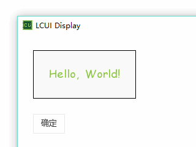

## 为界面添加用户交互

当前应用程序的界面还只是单纯的向用户展示信息，并不能根据用户的操作来做相应的事情，接下来将介绍如何让应用程序通过界面与用户进行交互。

首先，修改 XML 文件，添加按钮部件，为了能够在程序中操作它们，还需要为它们设置 ID，ID 内容可以由你自己定义，但 ID 必须是整个程序中唯一存在的。

``` xml
<?xml version="1.0" encoding="UTF-8" ?>
<lcui-app>
  <resource type="text/css" src="helloworld.css"/>
  <resource type="application/font-ttf" src="C:/Windows/Fonts/comic.ttf"/>
  <ui>
    <widget id="text-hello" type="textview" class="text-hello">Hello, World!</widget>
    <widget id="btn-ok" type="button">确定</widget>
  </ui>
</lcui-app>
```

接下来补充 CSS 代码，设置按钮的外间距，调整按钮的位置。

``` css
textview.text-hello {
  color: #8cc63f;
  font-size: 18px;
  font-family: "Comic Sans MS";
  text-align: center;
  padding: 25px;
  margin: 25px 0 0 25px;
  border: 1px solid #000;
  background-color: #fafafa;
}
#btn-ok {
  margin: 25px 0 0 25px;
}
```

最后，补充事件绑定与事件响应代码：

``` c
#include <LCUI_Build.h>
#include <LCUI/LCUI.h>
#include <LCUI/gui/widget.h>
#include <LCUI/gui/builder.h>
#include <LCUI/gui/widget/textview.h>

static void OnBtnClick( LCUI_Widget self, LCUI_WidgetEvent e, void *arg )
{
        LCUI_Widget txt = e->data;
        TextView_SetTextW( txt, L"第一个 LCUI 应用程序" );
}

int main( int argc, char **argv )
{
        LCUI_Widget root, pack, btn, txt;

        LCUI_Init();
        root = LCUIWidget_GetRoot();
        pack = LCUIBuilder_LoadFile( "helloworld.xml" );
        if( !pack ) {
                return -1;
        }
        Widget_Append( root, pack ); 
        Widget_Unwrap( pack );
        txt = LCUIWidget_GetById( "text-hello" );
        btn = LCUIWidget_GetById( "btn-ok" );
        Widget_BindEvent( btn, "click", OnBtnClick, txt, NULL );
        return LCUI_Main();
}
```

和常规的图形界面程序一样，LCUI 的应用程序也是事件驱动的，用户操作图形界面会产生事件，程序可以预先绑定这些事件，等事件触发后，程序员就能响应这些事件并做相应的事情。

以上代码的功能是让按钮在点击后将 "hello, world!" 更改为 "第一个 LCUI 应用程序"，代码具体说明如下：

- 使用 `LCUIWidget_GetById()` 函数根据 ID 来获取需要操作的部件。
- 为按钮绑定点击（click）事件，事件处理函数为 `OnBtnClick()`，附加的数据是 txt，该数据不需要析构函数，所以设为 NULL。
- 在 `OnBtnClick()` 函数中，第一个参数是绑定该事件的部件，第二个参数是事件相关的数据，第三个是触发该事件时传递的额外参数，这个参数通常用不到。
- 绑定事件时保存的附加数据存在于 data 成员变量中，即：`e->data` 。
- `TextView_SetTextW()` 函数是 `TextView_SetText()` 函数的宽字符版本，它的第二个参数是类型为 `wchar_t*` 的指针，这里设置的文本内容包含中文，由于 `TextView_SetText()` 函数是默认将第二个参数作为 UTF-8 编码的字符串进行处理的，而 Windows 系统的编译器会将字符串以 ANSI 编码方式存储，为避免乱码，所以改用宽版本的 `TextView_SetTextW()` 函数。

以下是该应用程序的运行效果：



以上供用户操作的只有按钮，接下来将添加文本编辑框，让用户输入自己的内容。

修改 helloworld.xml 文件，添加文本编辑框，并设置初始文本为 Hello, World!。

``` xml
<?xml version="1.0" encoding="UTF-8" ?>
<lcui-app>
  <resource type="text/css" src="helloworld.css"/>
  <resource type="application/font-ttf" src="C:/Windows/Fonts/comic.ttf"/>
  <ui>
    <widget id="text-hello" type="textview" class="text-hello">Hello, World!</widget>
    <widget id="edit" type="textedit">Hello, World!</widget>
    <widget id="btn-ok" type="button">确定</widget>
  </ui>
</lcui-app>
```

修改 helloworld.css 文件，调整文本编辑框的外间距。

``` css
textview.text-hello {
  color: #8cc63f;
  font-size: 18px;
  font-family: "Comic Sans MS";
  text-align: center;
  padding: 25px;
  margin: 25px 0 0 25px;
  border: 1px solid #000;
  background-color: #fafafa;
}
#btn-ok, #edit {
  margin: 25px 0 0 25px;
}
```

然后修改 helloworld.c 文件，让程序能够在按钮点击后取出文本编辑框内的文本，并将这些文本显示出来。

``` c
#include <LCUI_Build.h>
#include <LCUI/LCUI.h>
#include <LCUI/gui/widget.h>
#include <LCUI/gui/builder.h>
#include <LCUI/gui/widget/textview.h>
#include <LCUI/gui/widget/textedit.h>

static void OnBtnClick( LCUI_Widget self, LCUI_WidgetEvent e, void *arg )
{
        wchar_t str[256];
        LCUI_Widget edit = LCUIWidget_GetById( "edit" );
        LCUI_Widget txt = LCUIWidget_GetById( "text-hello" );
        TextEdit_GetTextW( edit, 0, 255, str );
        TextView_SetTextW( txt, str );
}

int main( int argc, char **argv )
{
        LCUI_Widget root, pack, btn;

        LCUI_Init();
        root = LCUIWidget_GetRoot();
        pack = LCUIBuilder_LoadFile( "helloworld.xml" );
        if( !pack ) {
                return -1;
        }
        Widget_Append( root, pack ); 
        Widget_Unwrap( pack );
        btn = LCUIWidget_GetById( "btn-ok" );
        Widget_BindEvent( btn, "click", OnBtnClick, NULL, NULL );
        return LCUI_Main();
}
```

`TextEdit_GetTextW()` 函数用于取出文本编辑框内的文本，它的第二个参数是起始读取位置，第三个参数是文本最大长度，返回值为实际读取的文本长度。

以下是该应用程序的运行效果：


